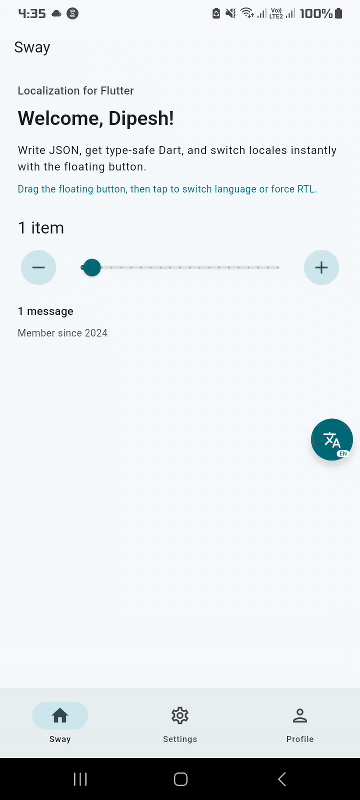

# Sway

**The localization layer for Flutter** — type-safe strings, an in-app locale switcher, and one-command migration from ARB, easy_localization, and slang.

<p align="center">
  <a href="https://pub.dev/packages/sway"></a>
  <a href="LICENSE"></a>
</p>

<p align="center">
  
</p>

<p align="center"><em>Debug overlay — change language and force RTL/LTR without touching device settings.</em></p>

## Why Sway?

| Need | Sway |
|------|------|
| Nested JSON → type-safe Dart | `dart run sway:codegen` |
| Switch locale / preview RTL in debug | `SwayOverlay` |
| Keep ARB / easy_localization / slang | Overlay-only adapters |
| Move into Sway later | `dart run sway:migrate` |

## Install

```bash
dart pub add sway
```

## 60-second quickstart (full Sway format)

**1. Create** `lib/i18n/en.sway.json`:

```json
{
  "home": {
    "welcome": "Welcome, {name}!",
    "itemCount": {
      "one": "{count} item",
      "other": "{count} items"
    }
  }
}
```

**2. Generate**

```bash
dart run sway:codegen
```

Creates `sway.g.dart` + `sway_en.g.dart` (and more locales as you add them).

**3. Wire the app**

```dart
import 'package:flutter/material.dart';
import 'package:sway/sway.dart';
import 'i18n/sway.g.dart';

class MyApp extends StatefulWidget {
  const MyApp({super.key});
  @override
  State<MyApp> createState() => _MyAppState();
}

class _MyAppState extends State<MyApp> {
  Locale _locale = const Locale('en');
  late final adapter = SwayFormatAdapter(
    supportedLocales: SwayTranslations.supportedLocales,
    currentLocale: _locale,
    onLocaleChange: (l) => setState(() => _locale = l),
  );

  @override
  Widget build(BuildContext context) {
    final translations = SwayTranslations.forLocale(_locale);
    return MaterialApp(
      locale: _locale,
      supportedLocales: SwayTranslations.supportedLocales,
      home: SwayScope(
        translations: translations,
        child: SwayOverlay(
          adapter: adapter,
          child: const HomePage(),
        ),
      ),
    );
  }
}

class HomePage extends StatelessWidget {
  const HomePage({super.key});
  @override
  Widget build(BuildContext context) {
    final t = context.t; // shorthand
    return Text(t.home.welcome(name: 'Dipesh'));
  }
}
```

### API cheatsheet

| Style | Code |
|--------|------|
| Shorthand | `context.t.home.welcome(name: '…')` |
| Context longhand | `SwayTranslations.of(context)` / `context.sway` |
| By locale | `SwayTranslations.forLocale(locale)` |
| Plurals | `t.home.itemCount(count: n)` |

Nested keys match your JSON (`profile.editProfile` → `t.profile.editProfile`) so sections with the same leaf name (`title`) never collide.

## Optional config — `lib/i18n/sway.config.json`

```json
{
  "baseLocale": "en",
  "localeDir": "lib/i18n",
  "outputFile": "lib/i18n/sway.g.dart",
  "fallbackStrategy": "baseLocale"
}
```

| Field | Meaning |
|-------|---------|
| `baseLocale` | Schema of truth for validation |
| `localeDir` | Where `*.sway.json` live |
| `outputFile` | Main generated Dart file |
| `fallbackStrategy` | `baseLocale` or `key` for missing strings |

## Overlay only (keep ARB / gen-l10n)

You do **not** need Sway JSON to use the floating switcher:

```dart
late final adapter = IntlAdapter(
  supportedLocales: AppLocalizations.supportedLocales,
  currentLocale: _locale,
  onLocaleChange: (l) => setState(() => _locale = l),
);

MaterialApp(
  locale: _locale,
  localizationsDelegates: AppLocalizations.localizationsDelegates,
  supportedLocales: AppLocalizations.supportedLocales,
  home: SwayOverlay(
    adapter: adapter,
    child: const MyHome(), // still uses AppLocalizations.of(context)
  ),
);
```

Also available: `EasyLocalizationAdapter`, `ManualAdapter`.  
Details: [doc/OVERLAY_ONLY.md](doc/OVERLAY_ONLY.md)

## Migration

```bash
# Always dry-run first
dart run sway:migrate --from arb --input lib/l10n --output lib/i18n --dry-run
dart run sway:migrate --from arb --input lib/l10n --output lib/i18n

dart run sway:migrate --from easy_localization --input assets/translations --output lib/i18n
dart run sway:migrate --from slang --input lib/i18n --output lib/i18n_migrated
```

| Source | Notes |
|--------|--------|
| ARB | ICU plurals → Sway plural objects; `select` flagged for manual fix |
| easy_localization | JSON supported (YAML/CSV → convert to JSON first) |
| slang | `$name` → `{name}` |

Full guide: [doc/MIGRATION.md](doc/MIGRATION.md)

## vs Flutter official (ARB + gen-l10n)

| | Official | Sway |
|--|----------|------|
| Source | Flat `.arb` | Nested `.sway.json` |
| Generate | `flutter gen-l10n` | `dart run sway:codegen` |
| Output | Main + per-locale parts | Same idea |
| Lookup | `AppLocalizations.of(context)!.key` | `context.t.section.key` |
| Debug locale UI | — | Built-in overlay |
| Migrate from others | — | Built-in CLI |

Step-by-step: [doc/INTEGRATION.md](doc/INTEGRATION.md)

## Commands

```bash
dart run sway:codegen
dart run sway:migrate --from arb --input lib/l10n --output lib/i18n
flutter test
```

## Example

```bash
cd example
flutter run
```

Six locales (`en`, `ar`, `es`, `de`, `ja`, `he`), plurals, RTL, and the overlay.

## Troubleshooting

| Symptom | Fix |
|---------|-----|
| `No SwayScope found` | Wrap UI with `SwayScope(translations: …)` |
| Overlay button missing | Pass an `adapter`; check debug/profile (hidden in release) |
| Overlay does not move | Drag the bubble; it snaps to left/right edge on release |
| Locale badge stale | Use one shared adapter for app + overlay |
| Codegen errors on extra keys | Base locale is schema of truth |
| Hot restart resets locale | Expected (reload keeps it; restart does not) |

## License

MIT — see [LICENSE](LICENSE).

<p align="center">© Darkmintis</p>
