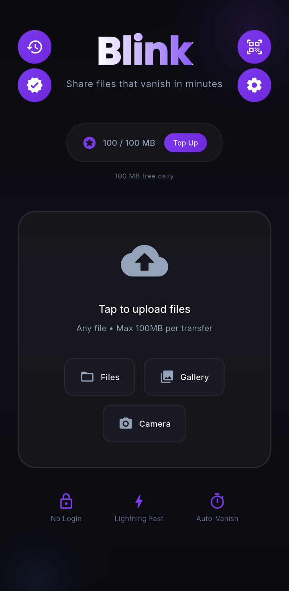
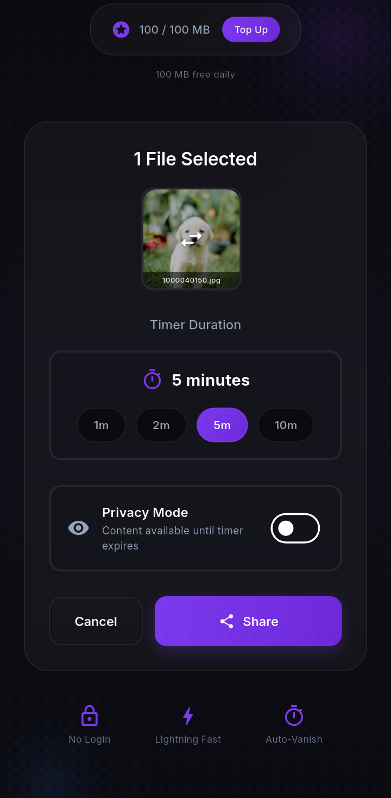
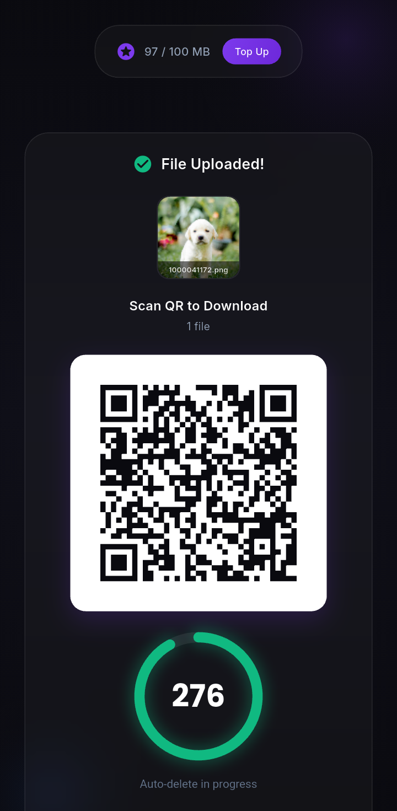
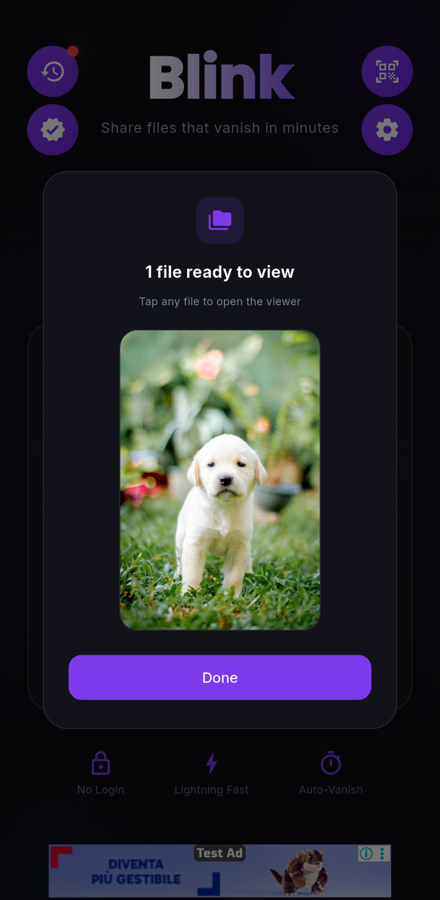

<p align="center">
  
</p>

<h1 align="center">Sway</h1>

<p align="center">
  The localization layer for Flutter — simple to author, instant to test, painless to migrate into.
</p>

<p align="center">
  <table>
    <tr>
      <td align="center" width="20%"></td>
      <td align="center" width="20%"></td>
      <td align="center" width="20%"></td>
      <td align="center" width="20%"></td>
      <td align="center" width="20%"></td>
    </tr>
  </table>
</p>

[](https://pub.dev/packages/sway)
[](LICENSE)

Type-safe Flutter localization with an instant in-app locale switcher and zero-friction migration from ARB, easy_localization, and slang.

## Features

- **Format + Codegen** — plain JSON per locale → nested type-safe Dart accessors
- **Overlay** — draggable debug bubble to switch locale and force RTL/LTR instantly
- **Migration CLI** — one-shot conversion from ARB, easy_localization, and slang
- CLDR plural rules, RTL table, cross-locale validation

## Quickstart

```bash
dart pub add sway
```

1. Create `lib/i18n/en.sway.json` (and more locales):

```json
{
  "home": {
    "welcome": "Welcome, {name}!",
    "itemCount": {
      "one": "{count} item",
      "other": "{count} items"
    }
  }
}
```

2. Optional `lib/i18n/sway.config.json`:

```json
{
  "baseLocale": "en",
  "localeDir": "lib/i18n",
  "outputFile": "lib/i18n/sway.g.dart",
  "fallbackStrategy": "baseLocale"
}
```

3. Generate:

```bash
dart run sway:codegen
```

This writes a main library plus one file per locale (Flutter gen-l10n style):

```
lib/i18n/sway.g.dart       # interfaces + registry — import this
lib/i18n/sway_en.g.dart    # English (part of sway.g.dart)
lib/i18n/sway_ar.g.dart    # Arabic
…
```

Still one import: `import 'i18n/sway.g.dart';`

4. Wire the app:

```dart
import 'package:flutter/material.dart';
import 'package:sway/sway.dart';
import 'i18n/sway.g.dart';

void main() => runApp(const MyApp());

class MyApp extends StatefulWidget {
  const MyApp({super.key});
  @override
  State<MyApp> createState() => _MyAppState();
}

class _MyAppState extends State<MyApp> {
  late final adapter = SwayFormatAdapter(
    supportedLocales: SwayTranslations.supportedLocales,
    currentLocale: const Locale('en'),
    onLocaleChange: (locale) => setState(() => _locale = locale),
  );
  Locale _locale = const Locale('en');

  @override
  Widget build(BuildContext context) {
    final t = SwayTranslations.of(_locale);
    return MaterialApp(
      locale: _locale,
      supportedLocales: SwayTranslations.supportedLocales,
      home: SwayOverlay(
        adapter: adapter,
        child: Scaffold(
          body: Center(
            child: Text(t.home.welcome(name: 'Dipesh')),
          ),
        ),
      ),
    );
  }
}
```

Use plurals as:

```dart
Text(t.home.itemCount(count: cartItems.length));
```

## Overlay

Place `SwayOverlay` under a route that has an `Overlay` (e.g. as `MaterialApp.home`), or wrap with your own `Overlay`.

- Drag the bubble; it snaps to the nearest left/right edge
- Tap to open locales + **Force RTL** / **Force LTR**
- Absent in release builds (`kReleaseMode`) unless you use it only in debug/profile
- Hard-disable anytime: `SwayOverlay.disabled(child: ...)` or `disabled: true`

## Migration

```bash
# Recommended first: dry-run
dart run sway:migrate --from arb --input lib/l10n --output lib/i18n_migrated --dry-run

dart run sway:migrate --from arb --input lib/l10n --output lib/i18n
dart run sway:migrate --from easy_localization --input lib/translations --output lib/i18n
dart run sway:migrate --from slang --input lib/i18n --output lib/i18n_migrated
```

| Source | Notes |
|--------|--------|
| ARB | ICU plurals → Sway plural objects; `select` / nested ICU flagged for manual conversion |
| easy_localization | JSON supported; YAML/CSV → convert to JSON first in 0.1.0 |
| slang | `$name` → `{name}`; context/enum variants flagged |

## Comparison (factual)

| | Sway | ARB / gen-l10n | easy_localization | slang |
|--|------|----------------|-------------------|-------|
| Nested JSON authoring | Yes | Flat ARB | Yes | Yes |
| Type-safe codegen | Yes (CLI) | Yes | Runtime | Yes |
| In-app locale overlay | Yes | No | No | No |
| Force RTL preview | Yes | No | No | No |
| Migrate from others | Built-in | — | — | — |

## Troubleshooting

| Symptom | Fix |
|---------|-----|
| Overlay button does not move | Ensure you are on a debug/profile build; drag uses `OverlayEntry.markNeedsBuild` (update if on an older preview) |
| Overlay missing | Pass an `adapter`; check console for loud `FlutterError` |
| `Overlay.of` failed | Put `SwayOverlay` under `MaterialApp` (e.g. `home:`) |
| Hot restart resets locale | Expected — overlay state survives hot **reload**, not full restart |
| Codegen errors on extra keys | Base locale is schema of truth; remove extras or add them to the base file |
| Generated file out of date | Re-run `dart run sway:codegen` after editing `*.sway.json` |

Commit `sway.g.dart` + `sway_*.g.dart` parts, or regenerate in CI — pick one team convention.

## Testing

```bash
flutter test
```

## License

MIT — see [LICENSE](LICENSE).

<p align="center">© Darkmintis</p>
